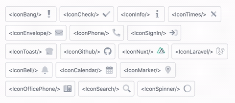

<p align="center">
  
</p>

[](https://www.npmjs.com/package/tv-icon)
[](https://nuxtjs.org)

[](https://www.npmjs.com/package/tv-icon)
[](https://www.npmjs.com/package-tv-icon)
<!-- [](https://discord.gg/enn4S6) -->

> These are the icons used by [tv-toast](https://github.com/acidjazz/tv-toast) and [tv-button](https://github.com/acidjazz/tv-button)

## Custom colors 

```html
<div class="bg-white p-2 rounded border mr-10">
    <IconCheck primary="text-green-300" secondary="text-green-400" class="w-5 h-5" />
</div>
```


```html
<div class="bg-white p-2 rounded border mr-10">
    <IconBang primary="text-red-300" secondary="text-red-400" class="w-5 h-5" />
</div>
```


